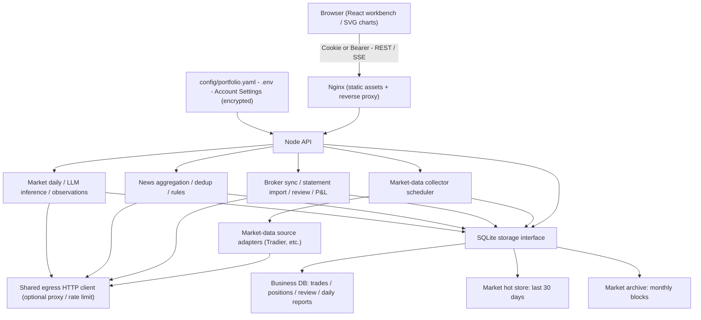

# invest-monitor

**[中文](README.md)**

A self-hosted, local-first review workbench for individual investors. It pulls positions, trades and account balances from several brokers on a read-only basis, normalizes P&L to USD, and organizes everything around trade review, macro research/journaling and risk-exposure analysis — one place to look at your portfolio instead of splitting the job across a trading terminal, a spreadsheet and a notes app.

Who it's for: individual investors/options traders who place their own trades and want a single, honest view of net P&L and risk exposure across multiple brokers.

**This is not a trading bot.** Every broker connection is read-only (positions, trades, account balances); the project never places, modifies or cancels an order. Risk-exposure analysis and the market-daily LLM inference produce reference information, not instructions to execute.

## Features

**Accounts & positions**
- Multi-broker read-only sync: [Tradier](https://tradier.com) API, IBKR (Interactive Brokers) Flex reports, Charles Schwab Trader API (OAuth 2.0), Alpaca Trading API
- Statement PDF import fills in history for brokers without an API (an "Elephant" brokerage statement layout ships as the verified example)
- Combined positions across all brokers, USD net P&L (realized/unrealized) and fee totals
- Daily P&L candles sampled every 30 minutes during regular U.S. market hours plus one close-of-day sample, aggregated by New York trading day

**Trade review**
- Trading cases: trades are grouped automatically, with weighted-average open/close pricing, per-fill detail and fee breakdown
- Evidence-graded automatic merging (same multi-leg order, same-second opens) plus human-confirmed "merge by suggestion" for weaker evidence
- Automatic recognition of common option opening structures (vertical spreads, straddles, iron condors, etc.), underlying direction shown ahead of contract long/short
- Per-trade review (conclusion + next-time improvement) and weekly review (net result, macro context, next week's watch items)

**Macro research & market daily**
- Cross-market charts for indices/futures/spot/ETFs/rates, day/week/month views, ten-year monthly statistics
- Sector observation notes and a geopolitical event timeline
- Market daily: a long-horizon macro journal the user writes by hand, optionally analyzed by an LLM (DeepSeek / OpenAI-compatible) for continuity across entries; the model can only update open "pending verification" observations, never overwrite your own text

**Risk exposure analysis**
- Per-leg delta notional plus a theme catalog (~40 themes, 400+ symbols) with multi-membership mapping
- U.S. equity legs adjusted by a locally regressed beta, surfacing states like "large unhedged short"
- R1–R5 balancing/hedging rules as reference, with a one-click export of a reference pack (method, rules, data) for use with other LLMs

**Quotes & charts**
- Stock/ETF/option quotes, search, option chains and Greeks — all from Tradier
- Daily candles (240 preloaded, 80 shown by default, MA5/15/30/200), intraday charts, Call/Put expiration comparison

**News**
- RSS aggregation, dedup (URL canonicalization + content hash + SimHash/MinHash), rule-based tagging, source provenance kept

## Screenshots

Generated by [`scripts/capture-screenshots.mjs`](scripts/capture-screenshots.mjs), which runs an in-page masking pass before each capture: account-like tokens are fully replaced, other digits are swapped for random digits of the same length, and dates/times are left readable. Figures shown are synthetic and do not reflect real holdings.

| | |
| --- | --- |
| <br>Overview: net worth, net P&L and the risk-exposure entry point | <br>Positions: combined view across brokers |
| <br>Risk exposure: theme exposure and balancing actions | <br>Brokers: sync status, funds and fee breakdown |
| <br>Trade review: trading cases and per-trade notes | <br>Macro research: market daily journal |
| <br>Account settings: broker and LLM credentials (encrypted) | <br>Options: chain, Greeks and expiration comparison |

## Quick start

Three install modes; full steps, the environment variable reference and troubleshooting live in [docs/INSTALL.md](docs/INSTALL.md) (Chinese).

**1. From source** (requires Node.js >= 24)

```bash
git clone <repo-url> invest-monitor && cd invest-monitor
npm ci
npm run build
cp .env.example .env   # optional: broker tokens, LLM, etc.
npm start               # defaults to http://127.0.0.1:3000 (adjust with API_PORT)
```

**2. Docker (prebuilt images)**

```bash
openssl rand -hex 24 > secrets/ui_auth_token   # bearer token for the CLI / scripts
docker compose -f docker-compose.ghcr.yml up -d
```

Or build from source: `docker compose up -d --build`.

**3. Portable bundle** (download `invest-monitor-<version>-<platform>.tar.gz`/`.zip` from GitHub Releases; ships its own Node runtime)

```bash
tar xzf invest-monitor-<version>-linux-x64.tar.gz
cd invest-monitor-<version>-linux-x64
./start.sh   # just run it; start.cmd on Windows. Optional ./install.sh installs it permanently
```

The default initial password is `123456`. The app keeps a warning banner up with a one-click prompt to change it until you do — please do that right away. Docker and the portable bundle both force password login on; running the source directly with plain `npm start` leaves login disabled by default (unless you set `UI_AUTH_MODE=password`), so that's only appropriate for local/isolated use.

## Configuration

Broker credentials, the LLM endpoint and the egress proxy are all configured on the **Account Settings** page (`#/settings`); saved values are encrypted and stored in the business database. Anything not set there falls back to environment variables, then to a default — the two can be mixed freely. Full field reference, encryption and read-only mode are documented in [docs/SETTINGS.md](docs/SETTINGS.md); the environment variable table is in [docs/INSTALL.md](docs/INSTALL.md).

The same REST endpoints serve both the browser and AI agents/scripts: authenticate with the CLI token (the contents of `secrets/ui_auth_token`) as a Bearer token and you can skip the CSRF header. The examples below assume the service is on port 8080 (the Docker/portable-bundle default); source mode defaults to 3000 unless you set `API_PORT`, so adjust accordingly.

```bash
# 1. Machine-readable schema (fields, types, examples) — a good first call for an AI agent
curl -s http://127.0.0.1:8080/api/settings/schema \
  -H "Authorization: Bearer $(cat secrets/ui_auth_token)"

# 2. Save a Tradier access token (PUT merges into existing overrides; null/"" clears one)
curl -s -X PUT http://127.0.0.1:8080/api/settings/tradier \
  -H "Authorization: Bearer $(cat secrets/ui_auth_token)" \
  -H "Content-Type: application/json" \
  -d '{"values": {"TRADIER_ACCESS_TOKEN": "<token>", "TRADIER_ENVIRONMENT": "live"}}'

# 3. Test the connection with whatever is currently in effect
curl -s -X POST http://127.0.0.1:8080/api/settings/tradier/test \
  -H "Authorization: Bearer $(cat secrets/ui_auth_token)"
```

## Supported brokers

| Broker | Integration | Sync cadence | Trading |
| --- | --- | --- | --- |
| [Tradier](https://tradier.com) | REST API (access token) | Every 15 min + 1 min before each trading day's close | No, read-only |
| IBKR (Interactive Brokers) | Flex Web Service report (token + query ID, XML) | Every 60 min | No, read-only |
| Charles Schwab | Trader API (OAuth 2.0, 7-day refresh token) | Every 15 min | No, read-only |
| Alpaca | Trading API (key, live or paper) | Every 15 min | No, read-only |
| Brokers without an API | Statement PDF import (CLI; two verified layouts today: Elephant and Tradier confirmations) | Manual, on demand | No, read-only |

Per-broker setup steps, the exact IBKR Flex query fields and the OAuth callback configuration are in [docs/BROKERS.md](docs/BROKERS.md) (Chinese).

## Architecture

A TypeScript npm-workspaces monorepo: a React 19 / Vite 7 frontend, a Node.js API that runs the market-data collector, news scheduler and daily-report inference in the same process, and SQLite for persistence. Production is two containers (Node API + Nginx serving static assets and reverse-proxying the API).



Market history uses a layered store (30-day hot region + monthly archive blocks + a catalog index) to avoid full-table scans; the frontend initializes with `GET /api/snapshot` and then receives incremental updates over SSE instead of polling the whole dashboard.

## Data & privacy

- **Everything lives in local SQLite** (business database plus the hot/archive market stores); nothing is uploaded to a third-party analytics or telemetry service.
- **Every broker connection is read-only**: positions, trades and account balances are read; there is no order placement, modification or cancellation capability.
- **Secrets are encrypted at rest**: broker tokens, LLM keys and similar values saved in Account Settings are encrypted with AES-256-GCM before being stored in the business database. The key comes from the `SETTINGS_ENCRYPTION_KEY` environment variable, or is generated automatically into a key file next to the database. Secret-typed fields are never returned in full by the API — only a masked, last-4-character form.
- **No built-in telemetry**: no usage analytics, no crash reporting to an external service. Outbound calls (LLM, market data) only happen on your configured schedule or when you trigger them, and only to the endpoints you configured.
- `.env`, `secrets/`, `data/` and `trade_file/` are all excluded from Git and from the Docker build context.

## Development

```bash
npm ci
npm run dev       # terminal 1: Node API + market-data collector (tsx, http://127.0.0.1:3000)
npm run dev:web   # terminal 2: Vite React frontend (http://127.0.0.1:5173, proxies /api and /health)
npm test          # vitest run, all workspaces
npm run build     # tsc -b plus the frontend build
```

Monorepo layout:

| Path | Purpose |
| --- | --- |
| `apps/server` | Node API: routing, auth, market-data collector scheduling, broker sync, review, daily-report inference |
| `apps/web` | React 19 + Vite frontend |
| `packages/domain` | Decimal-based money math, account/review/risk-exposure domain logic and data contracts, no I/O |
| `packages/storage` | SQLite storage layer (`node:sqlite` or `better-sqlite3`), layered market storage and archiving |
| `packages/adapters` | Market-data source adapters (Tradier, etc.) |
| `packages/collector` | Collector scheduler (dedup, concurrency and lease control) |
| `packages/config` | Config file loading, Zod validation and hot reload |
| `packages/egress` | Outbound HTTP client, proxying and rate limiting |
| `packages/intel` | News aggregation, dedup and rule-based governance |
| `docs` | Architecture, deployment and per-module notes (mostly Chinese) |
| `scripts` | CLI tools: statement import, screenshots, etc. |
| `tests` | Vitest tests, grouped by adapters/collector/domain/storage/workspace/etc. |

## Documentation index

- [Changelog](CHANGELOG.md): feature and rule changes per version.

Most in-depth documents are Chinese-only for now:

- [Install & deploy](docs/INSTALL.md) — three install modes, environment variable reference, upgrade/backup, troubleshooting
- [Account settings & API](docs/SETTINGS.md) — the settings page, encryption, full REST reference
- [Broker setup](docs/BROKERS.md) — per-broker steps, IBKR Flex fields, statement PDF import
- [Trade review & statement import](docs/TRADING-REVIEW.md)
- [Market daily](docs/MARKET-DAILY.md)
- [Daily-report LLM inference](docs/DAILY-INFERENCE.md)
- [Risk exposure analysis](docs/RISK-EXPOSURE.md)
- [Charts & market timing](docs/CHARTS.md)
- [Tradier market data](docs/TRADIER-MARKET-DATA.md)
- [Storage & performance](docs/STORAGE-PERFORMANCE.md)
- [Security](SECURITY.md)

## Limitations & disclaimer

- This is a personal review tool. **It is not investment advice.** Theme coefficients, betas and put-delta assumptions in the risk-exposure analysis are empirical estimates, not market data; the market-daily LLM inference produces model output that needs human review — it is not a precise forecast or an instruction to trade.
- No order placement, modification or cancellation; this is not an automated trading system and does not backtest strategies.
- Real option P&L cannot be derived from the underlying's daily candles; historical market/research data may be incomplete due to upstream provider limits — see each module doc's "limitations" section for specifics.
- Automatic multi-leg/open-close pairing is graded by evidence strength; where evidence is weak it only produces a human-confirmation suggestion rather than deciding for the user.

## License

MIT — see the `LICENSE` file at the repository root.
