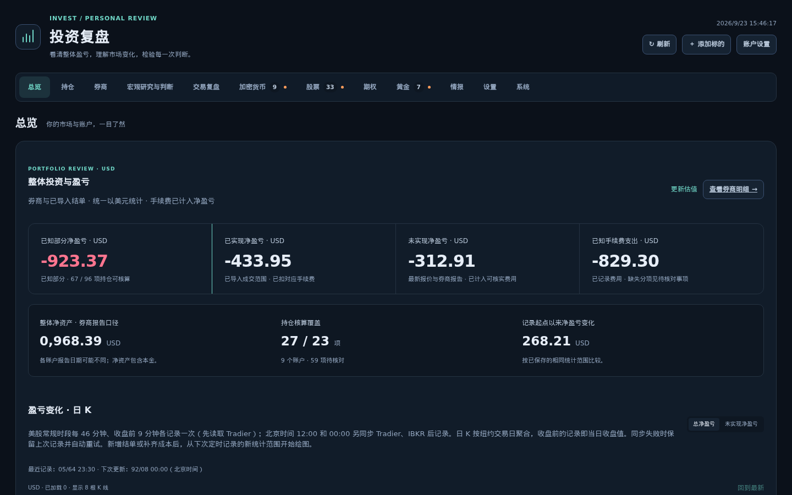
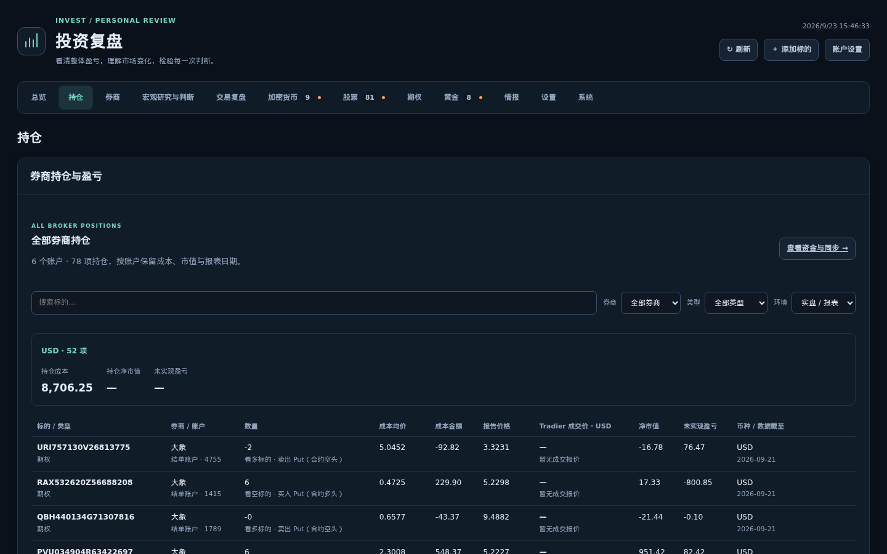
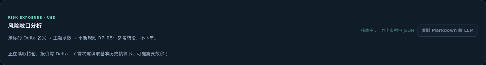
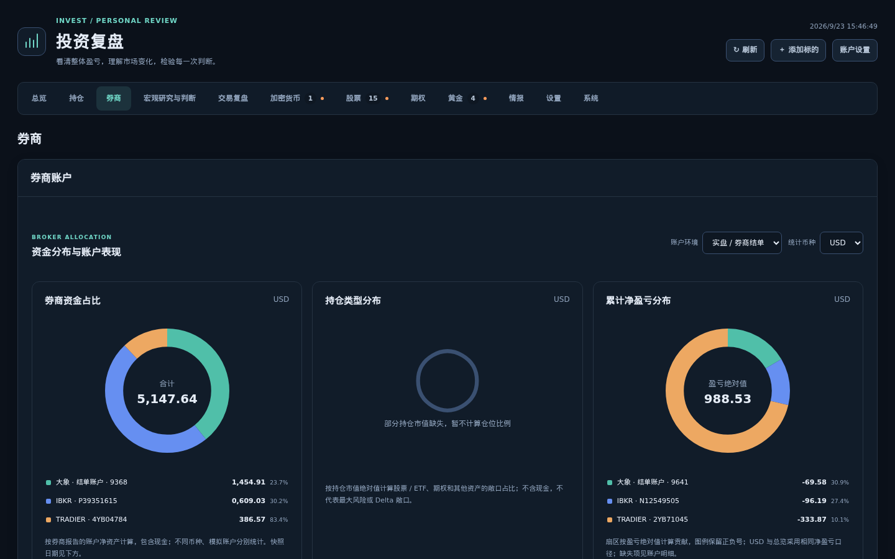
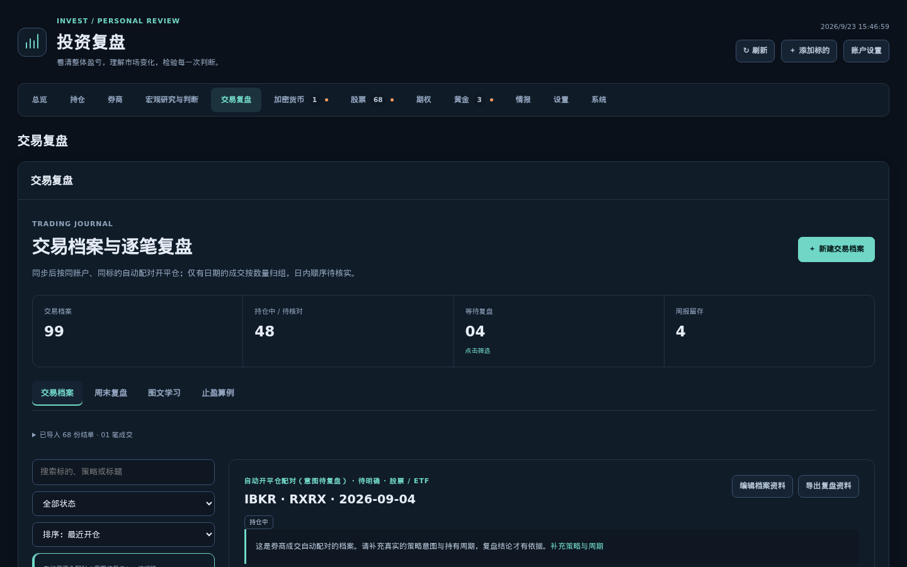
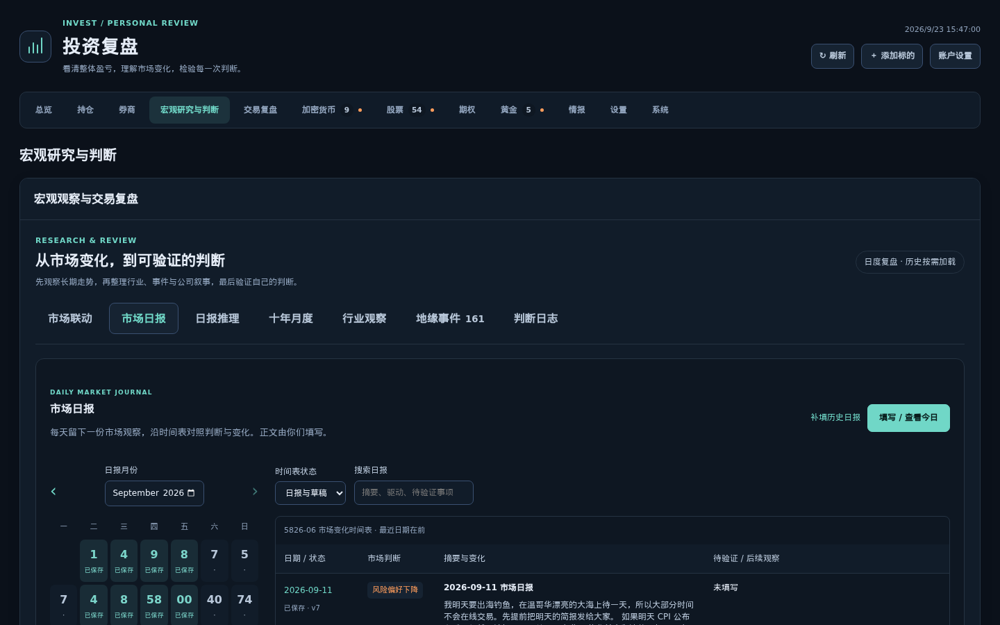
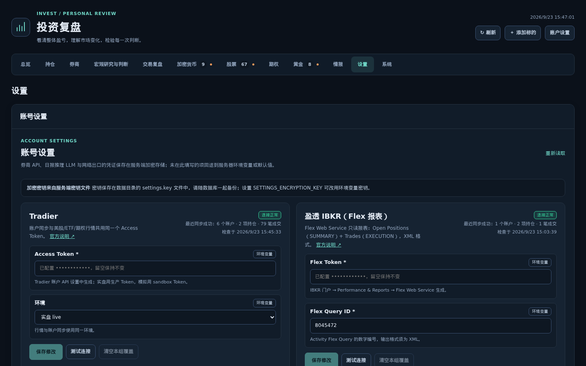
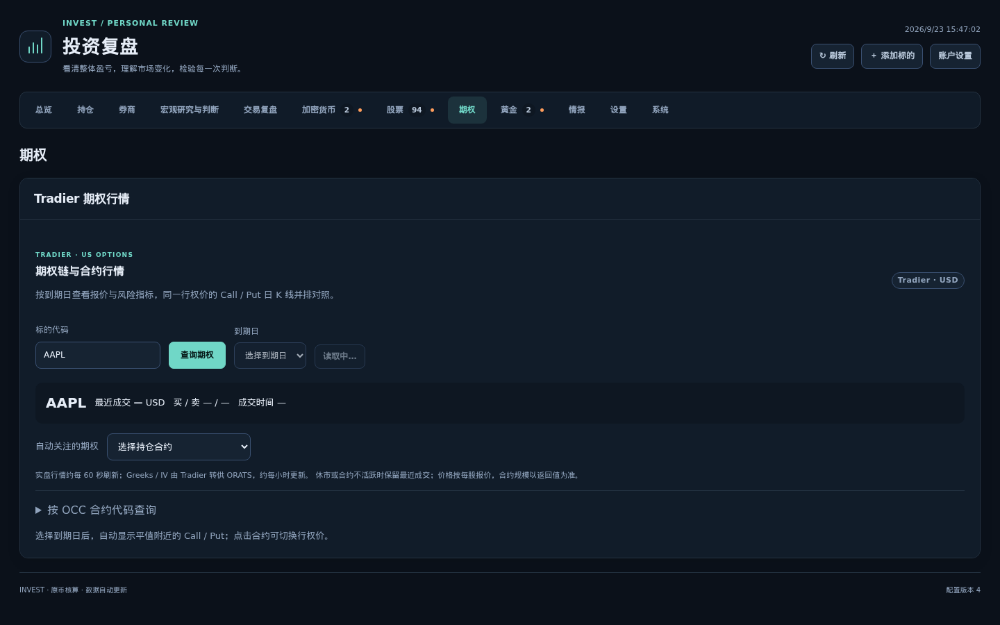
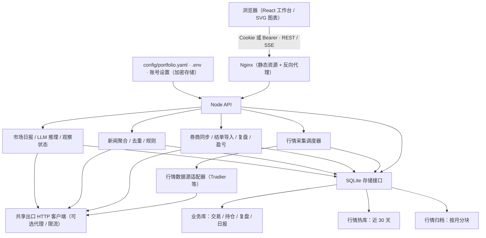

# invest-monitor

**[English](README.en.md)**

本地自托管的个人投资复盘工作台：把多个券商的持仓、成交和账户资金聚合成一份用 USD 统一口径的记录，围绕逐笔交易复盘、宏观研究/日报和风险敞口分析组织起来，目标是把"复盘"这件事做成可读、可追溯、可持续维护的工作流，而不是把行情软件、Excel 账本和笔记分开维护。

面向的用户：自己下单、自己复盘的个人投资者/期权交易者，尤其是持仓分布在多个券商、希望有一个统一视图看净盈亏和风险敞口的用户。

**这不是自动交易系统。** 所有券商接入均为只读同步（持仓、成交、账户资金），项目不提交、不修改、不撤销任何订单；风险敞口分析、日报 LLM 推理等模块产出的都是参考信息，不是可执行指令。

## 功能

**账户与持仓**
- 多券商只读同步：[Tradier](https://tradier.com) API、IBKR（盈透）Flex 报表、Charles Schwab Trader API（OAuth 2.0）、Alpaca Trading API
- 无官方 API 的券商通过对账单 PDF 导入补齐历史成交（"大象"证券对账单是目前随项目验证过的示例版式）
- 全券商持仓汇总、USD 净盈亏（已实现/未实现）与手续费统计
- 盈亏日 K：美股常规时段每 30 分钟 + 收盘前采样，按纽约交易日聚合

**交易复盘**
- 交易档案：成交自动归组、开平仓配对、逐笔明细与费用分项
- 同一多腿订单、同秒开仓等证据驱动的自动合并与"按建议合并"人工确认
- 期权开仓结构自动识别（垂直价差、跨式、铁鹰等常见结构），标的方向优先于合约多空
- 逐笔复盘（结论 + 下次改进）、周报（净收益、宏观变化、下周关注点）

**宏观研究与日报**
- 市场联动：指数/期货/现货/ETF/利率的日周月图、十年月度统计
- 行业观察与地缘事件时间线
- 市场日报：用户手工撰写的长周期宏观判断，可选接入 LLM（DeepSeek / OpenAI 兼容接口）做延续性推理，自动维护"待验证"观察状态

**风险敞口分析**
- 逐腿 Delta 名义 + 主题目录（约 40 余主题、400 余代码）多重归属
- 美股权益按本地历史回归 β 调整，识别"大量空头/多头未对冲"等状态
- R1–R5 平衡/对冲规则参考，一键导出给其他 LLM 使用的参考包（方法、规则、数据）

**行情与图表**
- 股票/ETF/期权行情统一来自 Tradier：搜索、报价、期权链、Greeks
- 日 K（预载 240 根、默认 80 根、MA5/15/30/200）、分时图、Call/Put 到期日对照

**新闻**
- RSS 聚合、去重（URL 规范化 + 内容哈希 + SimHash/MinHash）、规则标注、来源留痕

## 界面截图

以下截图由 [`scripts/capture-screenshots.mjs`](scripts/capture-screenshots.mjs) 生成；脚本会在截图前对页面做一次脱敏处理（账户类字符串整体替换、其余数字替换为等长随机数字，日期/时间保持可读），因此图中的金额、账户和合约编号均为模拟值，不代表真实持仓。

| | |
| --- | --- |
| <br>总览：净资产、净盈亏与风险敞口分析入口 | <br>持仓：全券商合并持仓视图 |
| <br>风险敞口分析：主题敞口与平衡动作参考 | <br>券商：同步状态、资金与费用分布 |
| <br>交易复盘：交易档案与逐笔复盘 | <br>宏观研究：市场日报 |
| <br>账号设置：券商与 LLM 凭证（加密存储） | <br>期权：期权链、Greeks 与到期日对照 |

## 快速开始

三种安装方式，详细步骤、环境变量参考和故障排查见 [docs/INSTALL.md](docs/INSTALL.md)。

**方式一：源码运行**（需要 Node.js ≥ 24）

```bash
git clone <repo-url> invest-monitor && cd invest-monitor
npm ci
npm run build
cp .env.example .env   # 可选：填写券商 Token、LLM 等
npm start               # 默认 http://127.0.0.1:3000（API_PORT 可调）
```

**方式二：Docker（预构建镜像）**

```bash
openssl rand -hex 24 > secrets/ui_auth_token   # CLI/脚本用的鉴权 token
docker compose -f docker-compose.ghcr.yml up -d
```

也可以从源码构建：`docker compose up -d --build`。

**方式三：便携包**（下载 GitHub Releases 中的 `invest-monitor-<version>-<platform>.tar.gz`/`.zip`，内置 Node 运行时）

```bash
tar xzf invest-monitor-<version>-linux-x64.tar.gz
cd invest-monitor-<version>-linux-x64
./start.sh   # 直接运行即可；Windows 用 start.cmd。可选 ./install.sh 固定安装到本机
```

默认初始密码为 `123456`，登录后请立即在"账户设置"中修改。Docker 和便携包都固定启用密码登录；直接用 `npm start` 跑源码时默认不校验登录（除非设置 `UI_AUTH_MODE=password`），只适合本机/隔离环境。

## 配置

券商凭证、LLM 接口和出口代理统一在网页的**账号设置**（`#/settings`）页面配置，保存后加密存储在业务数据库中；未在页面填写的项回退到环境变量，再回退到默认值。也可以完全通过 `.env` / 环境变量配置，两者可以混用。完整字段表、加密与只读模式说明见 [docs/SETTINGS.md](docs/SETTINGS.md)；环境变量总表见 [docs/INSTALL.md](docs/INSTALL.md)。

账号设置的 REST 接口同时服务浏览器和 AI Agent / 脚本：用 CLI token（`secrets/ui_auth_token` 文件内容）作为 Bearer 鉴权即可，不需要额外的 CSRF 头。以下示例假设服务运行在 8080（Docker/便携包默认端口）；源码模式不设置 `API_PORT` 时默认是 3000，请按实际端口替换。

```bash
# 1. 读取机器可读的接口说明（字段、类型、示例），适合 AI Agent 先探测再操作
curl -s http://127.0.0.1:8080/api/settings/schema \
  -H "Authorization: Bearer $(cat secrets/ui_auth_token)"

# 2. 写入 Tradier Access Token（PUT 是增量覆盖；把值设为 null 或空字符串即清除覆盖）
curl -s -X PUT http://127.0.0.1:8080/api/settings/tradier \
  -H "Authorization: Bearer $(cat secrets/ui_auth_token)" \
  -H "Content-Type: application/json" \
  -d '{"values": {"TRADIER_ACCESS_TOKEN": "<token>", "TRADIER_ENVIRONMENT": "live"}}'

# 3. 用当前生效的配置做一次连接测试
curl -s -X POST http://127.0.0.1:8080/api/settings/tradier/test \
  -H "Authorization: Bearer $(cat secrets/ui_auth_token)"
```

## 支持的券商

| 券商 | 接入方式 | 同步频率 | 下单 |
| --- | --- | --- | --- |
| [Tradier](https://tradier.com) | REST API（Access Token） | 15 分钟 + 每个交易日收盘前 1 分钟 | 否，只读 |
| IBKR（盈透） | Flex Web Service 报表（Token + Query ID，XML） | 60 分钟 | 否，只读 |
| Charles Schwab | Trader API（OAuth 2.0，刷新令牌 7 天有效） | 15 分钟 | 否，只读 |
| Alpaca | Trading API（Key，支持 live/paper） | 15 分钟 | 否，只读 |
| 无 API 的券商 | 对账单 PDF 导入（CLI，当前已验证大象、Tradier 确认单两种版式） | 按需手动运行 | 否，只读 |

逐个券商的申请步骤、IBKR Flex 查询需要勾选的具体字段、OAuth 回调配置见 [docs/BROKERS.md](docs/BROKERS.md)。

## 架构总览

TypeScript + npm workspaces 单仓库：React 19 / Vite 7 前端，Node.js API 与行情采集、新闻调度、日报推理同进程运行，SQLite 持久化。生产部署为两个容器（Node API + Nginx 静态资源/反向代理）。



行情历史采用"热区（近 30 天）+ 按月归档块 + 目录索引"的分层存储，避免整表扫描；前端通过 `GET /api/snapshot` 初始化后以 SSE 接收增量更新，而不是轮询整份看板。

## 数据与隐私

- **数据全部保存在本地 SQLite**（业务库 + 行情热库/归档库），没有把数据上传到第三方分析或遥测服务。
- **所有券商连接均为只读**：读取持仓、成交、账户资金，不具备下单、改单、撤单能力。
- **凭证加密存储**：账号设置中的券商 Token、LLM Key 等使用 AES-256-GCM 加密后存入业务库；密钥来自环境变量 `SETTINGS_ENCRYPTION_KEY`，或自动生成并保存在数据库同目录的密钥文件中。接口读取时密钥类字段永远只返回掩码（末 4 位），不会原样返回。
- **无内置埋点**：不采集使用行为、不上报崩溃信息给外部服务。日报 LLM、行情数据源等对外请求仅发生在用户主动触发或配置的采集周期内，且仅发往用户自己配置的地址。
- `.env`、`secrets/`、`data/`、`trade_file/` 均被 Git 和 Docker 构建忽略，不会随代码提交或打包进镜像。

## 开发

```bash
npm ci
npm run dev       # 终端 1：Node API + 行情采集调度器（tsx，http://127.0.0.1:3000）
npm run dev:web   # 终端 2：Vite React 前端（http://127.0.0.1:5173，代理 /api 与 /health）
npm test          # vitest run，全部工作区测试
npm run build     # tsc -b + 构建前端产物
```

Monorepo 目录结构：

| 路径 | 说明 |
| --- | --- |
| `apps/server` | Node API、请求路由、鉴权、行情采集调度、券商同步、复盘、日报推理等运行时组装 |
| `apps/web` | React 19 + Vite 前端 |
| `packages/domain` | 金额（Decimal）核算、账户/复盘/风险敞口等领域逻辑与数据契约，不含 I/O |
| `packages/storage` | SQLite 存储层（`node:sqlite` 或 `better-sqlite3`）、分层行情存储与归档 |
| `packages/adapters` | 行情数据源适配器（Tradier 等） |
| `packages/collector` | 采集调度器（去重、并发与租期控制） |
| `packages/config` | 配置文件加载、Zod 校验与热重载 |
| `packages/egress` | 出口 HTTP 客户端、代理与限流 |
| `packages/intel` | 新闻聚合、去重与规则治理 |
| `docs` | 架构、部署与各模块专题说明 |
| `scripts` | 结单导入、截图等 CLI 工具 |
| `tests` | Vitest 测试，按 adapters/collector/domain/storage/workspace 等分组 |

## 文档索引

- [安装与部署](docs/INSTALL.md) — 三种安装方式、环境变量参考、升级备份、故障排查
- [账号设置与 API](docs/SETTINGS.md) — 配置页、加密、REST 接口完整参考
- [券商接入](docs/BROKERS.md) — 各券商申请步骤、IBKR Flex 字段、对账单 PDF 导入
- [交易复盘与结单导入](docs/TRADING-REVIEW.md)
- [市场日报](docs/MARKET-DAILY.md)
- [日报 LLM 推理](docs/DAILY-INFERENCE.md)
- [风险敞口分析](docs/RISK-EXPOSURE.md)
- [图表与行情时间](docs/CHARTS.md)
- [Tradier 行情接入](docs/TRADIER-MARKET-DATA.md)
- [存储与性能](docs/STORAGE-PERFORMANCE.md)
- [安全](SECURITY.md)

## 局限与免责声明

- 本项目是个人复盘工具，**不构成投资建议**。风险敞口分析中的主题系数、β、认沽 Delta 假设都是经验估计，不是市场数据；日报 LLM 推理的结论由模型生成，需要人工审阅，不代表精确预测或操作指令。
- 不支持下单、改单、撤单；不是自动交易系统，也不做策略回测。
- 期权真实盈亏不能由标的日 K 反推；历史行情/研究数据可能因数据源限制而不完整，具体限制见各专题文档的"限制与后续"章节。
- 多腿策略/开平仓自动配对基于证据强弱分级处理，证据不足时只给出人工确认建议，不会替用户下判断。

## 许可证

MIT，见仓库根目录 `LICENSE` 文件。
