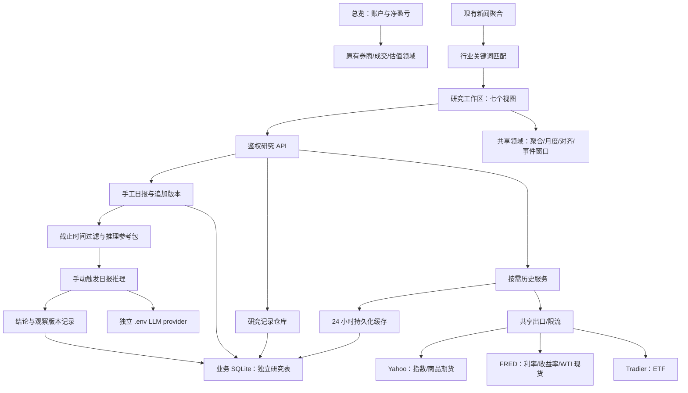

# 复盘工具与研究工作区架构

按用户 2026-09-06 的要求先交付可运行架构，随后开展多 Agent 深度研究。当前已填充 100 家公司、19 条行业报告、161 个主要历史事件；2026-09-12 新增19篇用户市场日报的判断/关联补齐，研究行情目录由23增至40项，补足SPY/QQQ、板块ETF、ES/NQ、白银期货、DXY/VIX。目录新增不自动订阅采集；实际核验见 [日报市场对照](daily-review-20260818-0911/README.md)。完整行业来源与覆盖边界见 [首批研究说明](industry-research-20260906/README.md)及[地缘扩充](geopolitics-2016-2026/README.md)。用户可继续维护，隔离测试示例不写入生产。

## 产品信息架构

- 总览：首先呈现券商报告净资产、已知净盈亏、已实现/未实现、费用与覆盖范围；进入持仓/券商或复盘的路径集中展示。
- 宏观研究与判断：市场联动、市场日报、日报推理、十年月度、行业观察、地缘事件、判断日志七个视图。
- 市场日报：用户手工填写正文/摘要/市场判断，月历及时间表回看，保留每次保存版本；草稿与归档不进入当前推理参考。参考包导出与按历史截止时间读取的接口见 [市场日报](MARKET-DAILY.md)。
- 日报推理：当前/历史日报、关联日K与勾选持仓 → 宏观判断和短/中/长三层操作参考 → 版本化待验证状态。独立 `.env` provider，手动触发异步任务；见 [日报推理与持续观察](DAILY-INFERENCE.md)。
- 市场联动：真实指数、黄金/原油期货、原油现货、美债收益率/有效利率及 ETF。日/周/月 K 与日度观测折线区分；统一日期范围对照。
- 十年月度：最近十个完整自然年逐年逐月涨跌热力表、均值/中位数/上涨比例/有效样本数、同一月份不同年份的日内月度路径（按自然日对齐）。
- 行业观察：科技、消费、医疗健康、工业与制造、材料与矿产五类；以明确命名的板块 ETF 观察指数方向，每类提供成熟企业/成长候选各 10 个手工观察位、资料与变更记录、已有情报关键词匹配。
- 地缘事件：日期、发生时段、地区、类型、事实、来源、可能传导机制、关联资产；在 K 线上标记并查看事前 5 个、事后 1/5/20/60 个观测期的价格变化。
- 判断日志：保留现有不可改写的原始判断与追加验证链。

## 模块边界

新增代码：领域 `packages/domain/src/research-market.ts`；历史适配/记录 API `apps/server/src/research-market.ts`；前端 `ResearchHub.tsx`、`ResearchCharts.tsx`、`SectorObservation.tsx`、`GeoObservation.tsx`。原判断日志继续由 `ResearchWorkspace.tsx` 维护。

## 数据契约与扩展点

`StudyInstrument` 定义 id、provider、symbol、kind、unit、来源链接和口径。`StudySeries` 保存原始日度价格、真实 OHLC（若来源提供）、覆盖起止、采集时间、价格口径与质量提示。前端只对日度序列聚合，不从现价拼造 K 线。

`research_series_cache` 按固定目录 id 保存一份日度快照，最多约 5000 行/序列；与高频行情热冷分区分离。地缘视图激活时自动加载当前总览/详情图表、五指数与当前事件 assetIds，其余视图保留手动按需加载。前端按共享 busy 只派发空闲的两项，切事件/隐藏后不继续旧需求；成功结果在页面内复用，进行中合并，失败/空结果仅显式重试。服务端成功缓存 24 小时，刷新最短间隔 60 秒，失败退避 5 分钟；旧缓存带明确失败/过期提示保留。研究外部加载最多并行两项，ETF 继续共用 Tradier Token 限流。请求不接受任意 URL 或任意供应商代码。

`research_board_records` 存储三种判别联合记录：event、company、note。sources 为可选多来源数组（标题/机构/链接/发布日期或空值/查阅日期/支持事实/置信度）；company/note 可带 subsector、tags，公司可带 stage。旧客户端 PATCH 省略元数据时继承，显式空值可清除；事件表单维持已有资产顺序。每项有 UUID、更新时间；归档保留原行。公司每行业每组限制 1–10 观察位，同组代码/位置不重复；位置代表用户优先级，不冒充实时市值或质量排名。

| API | 行为 |
| --- | --- |
| GET `/api/research/market/catalog` | 固定行情目录、行业映射、缓存策略、契约版本 |
| GET `/api/research/market/series?id=…` | 按需读取/获取历史；返回真实覆盖范围 |
| POST `/api/research/market/refresh` `{id}` | 手动刷新，保留退避和请求合并 |
| GET `/api/research/board` | 事件、观察公司、资料集合 |
| POST `/api/research/board/{events,companies,notes}` | 校验后创建 |
| PATCH `/api/research/board/{类型}/{id}` | 编辑用户维护内容 |
| DELETE `/api/research/board/{类型}/{id}` | 归档，保留数据库行 |
| GET/POST/PATCH `/api/research/daily-inference` 及子路径 | 异步模型研究、当前宏观判断、观察状态与历史；完整契约见 [推理文档](DAILY-INFERENCE.md) |
| GET/POST/PATCH `/api/research/daily-reports` 及子路径 | 手工日报、版本回看、按截止时间读取参考包；完整契约见 [日报文档](MARKET-DAILY.md) |

全部 API 复用现有登录与写入 CSRF 检查。研究接口不改动交易、密码和券商账户。内容字段只作为文本展示，来源仅允许 http/https；不会抓取用户提交的任意地址。

## 分析口径

- 时间范围从十个完整自然年前的上一年 12 月开始抓取，保留一月涨跌基准，并包含本年已完成交易日。当天数据在纽约次日后纳入。
- 月涨跌 = 当月末价格 / 上月末价格 − 1。缺少边界、历史覆盖不足、未完成月份留空；数据缺口不填零。价格涨跌不标成含分红投资总回报。季节性只是历史样本，不能自动解释为可预测周期。
- 跨资产仅使用共同观测日期、共同起点；价格比较用百分比，收益率/利率变化用 bp 并单独坐标。相关系数基于相邻共同观测变化，至少 30 个有效样本；不把水平相关性当传导结论。
- 地缘事件默认发生时段未知，明确披露可能跨收盘；收盘后事件从下一个观测日开始。周末事件映射至其后首个观测日，基准为此前最后收盘。对超过一周的边界缺口不计算；后续记录不足留空。窗口长度是供应商有效观测条数，异常缺口可能改变实际日期，展示实际起止。
- 黄金期货 GC=F、WTI 期货 CL=F 属于供应商近月合约序列，含换月影响；保留负油价，非正基准不计算百分比。原有 XAU/USD 现货报价与 GLD 身份不变。

## 数据来源与后续填充

Yahoo 公开历史接口不是有 SLA 的付费 API，可能限流或变更；通过 provider 层替换，不将缺失指数偷偷替换成 ETF。FRED CSV 使用公开日度数据；ETF 使用现有 Tradier 凭据。参考 [Yahoo 标普历史](https://finance.yahoo.com/quote/%5EGSPC/history/)、[FRED DGS10](https://fred.stlouisfed.org/series/DGS10)、[FRED DFF](https://fred.stlouisfed.org/series/DFF)、[Tradier 历史接口](https://docs.tradier.com/reference/brokerage-api-markets-get-history)、[State Street 行业分类](https://www.ssga.com/us/en/intermediary/capabilities/equities/sector-investing/select-sector-etfs)。

2026-09-06 13:00 前架构阶段的来源验收在**临时研究缓存**中完成，当时未向生产填入研究内容：标普 2706、纳指 2706、黄金期货 2705、WTI 期货 2706、美债 10 年收益率 2691、XLK 2692 条；最早均为 2015-12-01，美债截至 2026-09-03，其余截至 2026-09-04。XLK 有 14 条异常/缺失 OHLC 被跳过。此为六个代表序列的验收，不代表现有目录全部 23 项已逐项核对。

FRED CSV 在当前出口使用浏览器式请求头曾超时，标准下载请求组合验证可用，因此单独保留下载请求头；仍使用共享 HTTP 池和固定官方地址。Yahoo 全 OHLC 为 null 的日期槽（含休市日）属于无观测，不当作异常 K；部分缺失或 OHLC 矛盾才提示跳过。没有借此补造任何价格。

验收工具 `scripts/verify-research-browser.mjs` 只允许回环地址，启动方式是隔离 `tests/workspace/review-server.mjs` + Vite `INVEST_API_PROXY=http://127.0.0.1:3105`，可通过 `INVEST_PLAYWRIGHT_MODULE` 与 `INVEST_CHROMIUM_PATH` 指定已有浏览器依赖。测试价格由浏览器路由模拟，事件/公司/资料写入临时库并归档；不能把 fixture 截图解释为真实研究结果。证据位于 `data/research-architecture-20260906/`，`browser-report.json` 与 `source-report.json` 分别对应交互和真实来源。

首批内容现已按上述证据流程完成。包为 `docs/industry-research-20260906/content.json`，导入器 `scripts/import-research-content.mjs` 默认只读，--apply 才写入；写前备份、全包冲突检查、逐条回读，相同内容重跑跳过，失败保留部分记录与清单。禁止并发导入同键事件/报告；不覆盖用户已改内容。继续用判断日志追踪证伪和验证。自动行业检索首期复用已采集新闻的关键词匹配，后续可接报告提供商、公司 IR/SEC 披露和经核验的分类器；当前没有自动质量打分或自动生成 Top 10。

填充后验收脚本 `scripts/verify-research-content-browser.mjs` 默认只允许回环隔离库，`--production-read-only` 固定生产地址、使用 secrets Bearer 且拦截写入。验证来源、细分与主题筛选、140条记录和手机/桌面布局。内容脚本拦截生产自动历史尝试，仅核对内容；地缘专用脚本另行验证真实历史。隔离图表价格为明示 fixture，SSE 为测试 stub；不以截图推断真实市场变化或推送健康。

2026-09-06 14:41 UTC 新增 SOXX、XLB 生产真实来源验收：分别 2697、2681 根，2015-12-01 至 2026-09-04；分别跳过 9、25 条缺失/异常 OHLC，不补造价格。见 `data/industry-research-20260906/new-benchmark-sources.json`。

## 地缘总览扩充（2026-09-06）

新增年份/类型/地区/全文筛选、事件JSON导出与五指数长周期总览。全时间范围默认月K，单年默认日K；相同周期事件合并标记并可键盘选择。手机SVG在图内横向滚动。五指数是默认时间对照，不改存储assetIds；其他资产按已有关联显示。事件必须先映射实际响应日和完整聚合周期，再裁切可见窗口，并显式限制图表截止日。

本轮新增140事件，原21事件及100公司/19报告保留。真实五指数每项2706条历史、805组事件窗口及上线验收见Handoff当前记录；旧脚本默认首批21事件断言不可对当前生产原样运行。

2026-09-06 16:22 UTC 地缘历史自动关联已上线：`GeoObservation` 由 Hub 传入 active，按共享 data/errors/busy 和稳定资产键派发最多两项；自动流程无持久队列，视图隐藏或切事件淘汰未开始需求。全部手动历史入口在已有请求期间禁用。自动调度、错误/空数据重试、缓存复用和生产真实历史的证据见 [Handoff](HANDOFF.md#2026-09-06-地缘历史自动关联验收)。
